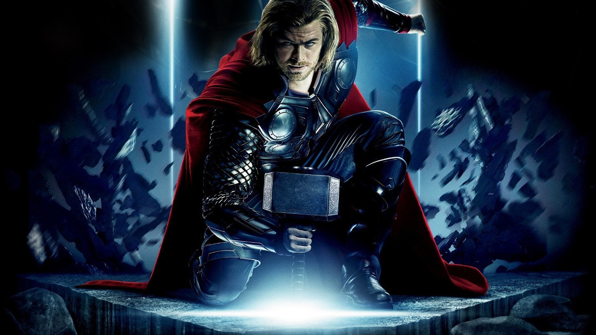
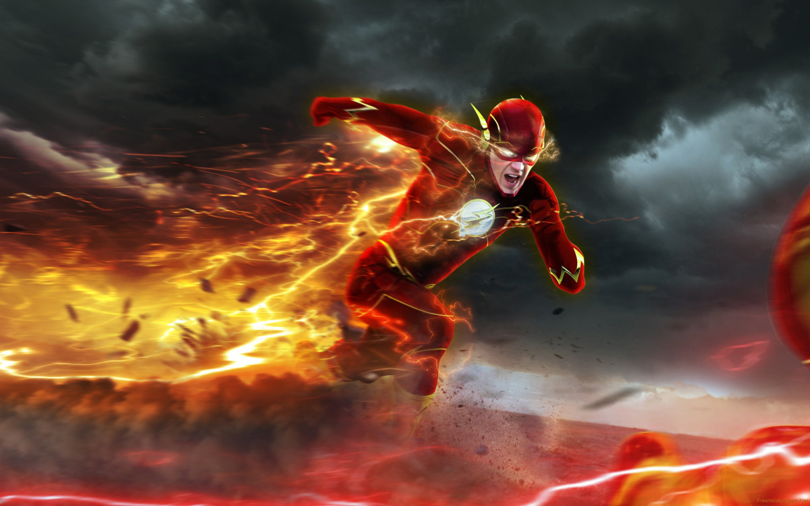

===================================
Ejercicios 1.
===================================

<li>
    <a href="#inicio">Inicio</a>
</li>

<li>
    <a href="#marvel">Marvel</a>
</li>

<li>
    <a href="#dccomics">DC comics</a>
</li>

<li>
    <a href="#contacto">Contacto</a>
</li>

===================================
Ejercicios 2.
===================================

<li>
    <a href="#" class="btn btn-default btn-lg">
        <i class="fa fa-facebook fa-fw"></i>
        Facebook
    </a>
</li>

<li>
    <a href="#" class="btn btn-default btn-lg">
        <i class="fa fa-twitter fa-fw"></i>
        Twitter
    </a>
</li>

<li>
    <a href="#" class="btn btn-default btn-lg">
        <i class="fa fa-github fa-fw"></i>
        Github
    </a>
</li>

===================================
Ejercicios 3.
===================================

    

        

        

        <h2 class="section-heading">Black Widow #TeamStark</h2>
        
La Viuda Negra ("Black Widow" en inglés) es un personaje ficticio que pertenece a Marvel Comics. Dentro del Universo Marvel hay varias viudas negras, todas ellas pertenecen o han pertenecido a una organización espía rusa. La más importante es Natasha Romanoff.

    

    

        
    

    

        

        

        <h2 class="section-heading">Hulk #NoTeam</h2>
        
Hulk es un superhéroe verde que aparece en los cómics estadounidenses publicados por la editorial Marvel Cómics. El personaje fue creado por Stan Lee y Jack Kirby siendo su primera aparición en The Incredible Hulk #1 publicado en mayo de 1962.

    

    

        
    

    

        

        

        <h2 class="section-heading">Capitan America #TeamCap</h2>
        
El Capitán América (en inglés Captain America) es un justiciero ficticio que aparece en cómics estadounidenses publicados por Marvel Comics. Creado por los historietistas Joe Simon y Jack Kirby.

    

    

        
    

    

        

        

        <h2 class="section-heading">DeadPool #NoTeam</h2>
        
Wade Winston Wilson, mejor conocido como Deadpool (adaptado como Masacre en algunas traducciones españolas),1 es un personaje ficticio, mercenario y héroe, que aparece en los cómics publicados por Marvel Comics, es un personaje ficticio, mercenario y héroe, que aparece en los cómics publicados por Marvel Comics. 

    

    

        
    

    

        

        

        <h2 class="section-heading">Hawkeye #TeamCap</h2>
        
Clinton Francis "Clint" Barton, alias Ojo de Halcón (originalmente, Hawkeye) es un superhéroe de Marvel Comics creado por el guionista Stan Lee y el dibujante Don Heck para el número 57 (septiembre de 1964) de Tales of Suspense como un villano.

    

    

        
    

    

        

        

        <h2 class="section-heading">Thor #NoTeam</h2>
        
Thor (del nórdico antiguo Þórr; Dzor, pronunciado tradicionalmente en español como Tor) es el dios del trueno en la mitología nórdica y germánica. Su papel es complejo ya que tenía influencia en áreas muy diferentes, tales como el clima, las cosechas, la protección, la consagración, la justicia, las lidias, los viajes y las batallas.

    

    

        
    

===================================
Ejercicios 4.
===================================

    

        

        

        <h2 class="section-heading">Batman #DCComics</h2>
        
Batman (conocido inicialmente como The Bat-Man) es un personaje creado por los estadounidenses Bob Kane y Bill Finger, y propiedad de DC Comics. Apareció por primera vez en la historia titulada «El caso del sindicato químico» de la revista Detective Comics n.º 27, lanzada por la editorial National Publications en mayo de 1939.

    

    

        
    

    

        

        

        <h2 class="section-heading">Flash #DCComics</h2>
        
The Flash es un superhéroe ficticio que aparece en cómics estadounidenses publicados por DC Comics. Creado por el escritor Gardner Fox y el artista Harry Lampert, el Flash original apareció por primera vez en Flash Comics #1 (enero de 1940), primera vez en Flash Comics #1 (enero de 1940).

    

    

        
    

    

        

        

        <h2 class="section-heading">Mujer Maravilla #DCComics</h2>
        
La Mujer Maravilla (en inglés: Wonder Woman) es una superheroína ficticia creada por William Moulton Marston para la editorial DC Comics. El personaje es una princesa guerrera de las amazonas (basado en la mitológica raza de las amazonas de la mitología griega) y es conocida en su tierra natal como la princesa Diana de Themyscira.

    

    

        
    

===================================
Ejercicios 5.
===================================

<li>
    <a href="#" class="btn btn-default btn-lg">
        <i class="fa fa-facebook fa-fw"></i>
        Facebook
    </a>
</li>

<li>
    <a href="#" class="btn btn-default btn-lg">
        <i class="fa fa-twitter fa-fw"></i>
        Twitter
    </a>
</li>

<li>
    <a href="#" class="btn btn-default btn-lg">
        <i class="fa fa-github fa-fw"></i>
        Github
    </a>
</li>